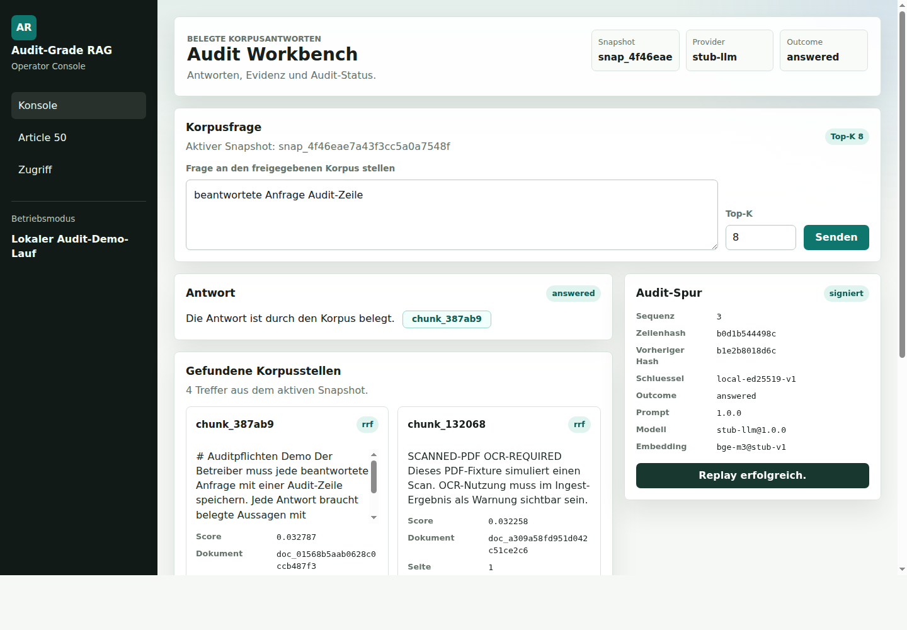
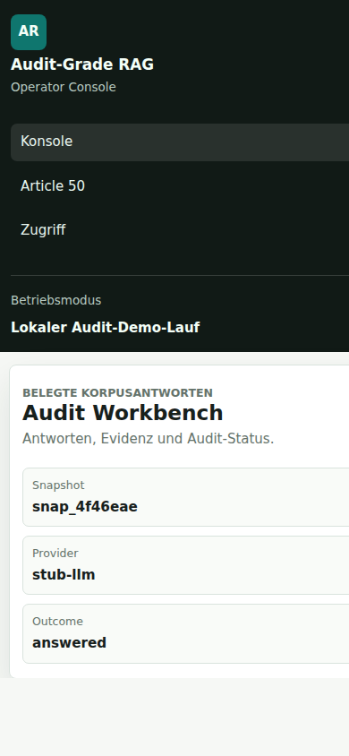

# Audit-Grade RAG

Audit-Grade RAG is a TypeScript reference implementation for a self-hosted,
single-organization RAG assistant. It focuses on traceable answers: every
response has claim-level citations, an append-only signed audit row,
deterministic replay checks, and a reproducible EU AI Act Article 50 report
bundle.

The demo is intentionally local and deterministic. It gives operators a working
German console without external analytics, third-party JavaScript, or live LLM
credentials.

## Screenshots

Desktop operator console:



Mobile operator console:



## Five-Minute Install

```bash
corepack enable
pnpm install --frozen-lockfile
pnpm check:full
pnpm dev
```

Open `http://127.0.0.1:3000/console`.

The local demo bootstraps a demo operator, ingests `examples/demo-corpus`, runs a
deterministic query, and renders the operator console with answer, citations,
retrieved evidence, and audit status.

## What It Implements

- Passwordless operator bootstrap and WebAuthn-shaped enrolled sessions.
- PDF, DOCX, and Markdown fixture ingestion with OCR and hidden-text warnings.
- Snapshot-aware retrieval with dense/BM25 scoring, RRF merge, top-K bounds, and
  out-of-corpus refusal.
- Cited generation with pinned prompt/model metadata, one retry, and blocked
  uncited output handling.
- Signed append-only audit ledger with hash-chain verification and sealed export.
- Replay states for bit-equal pass, prompt/corpus/model drift, cloud byte
  mismatch, and unsupported providers.
- Golden-set eval with groundedness, citation accuracy, refusal correctness, and
  per-tag breakdown.
- Deterministic Article 50 report bundle with JSON, PDF-shaped text artifact,
  audit excerpt, and manifest hashes.
- German operator UI with CSP, keyboard-reachable controls, no analytics, and no
  external scripts.

## Project Layout

```text
src/app/              Reference app composition
src/commands/         CLI and dev-server entrypoints
src/domain/           Shared domain types
src/modules/auth/     Operator auth and session state
src/modules/ingest/   Corpus ingestion and snapshots
src/modules/retrieval Retrieval ranking and refusal logic
src/modules/generation Prompting, providers, claim validation
src/modules/audit/    Signed hash-chain ledger
src/modules/replay/   Replay verification states
src/modules/eval/     Golden-set parser and thresholds
src/modules/report/   Article 50 report bundle
src/modules/ui/       German operator-console HTML/CSS
docs/                 Operator, security, audit, replay, and report docs
examples/demo-corpus/ Demo PDF/DOCX/Markdown corpus fixtures
```

## CLI

```bash
pnpm ingest --corpus examples/demo-corpus --dry-run
pnpm audit:export --since 2026-05-10T00:00:00.000Z --until 2026-05-10T23:59:59.999Z --out /tmp/agr-export
pnpm audit:verify --ledger /tmp/agr-export/audit-ledger.sqlite
pnpm audit:replay
pnpm report --format eu-ai-act-50 --since 2026-05-10T00:00:00.000Z --until 2026-05-10T23:59:59.999Z --out /tmp/agr-report
```

## Verification

```bash
pnpm check:fast
pnpm check:full
pnpm build
```

`pnpm check:full` runs typecheck, Biome, ESLint, unit tests, knip, integration
tests, build-backed e2e, and the eval harness.

## Docker Compose

```bash
docker compose up --build
```

The demo serves the operator console on `http://127.0.0.1:3000/console`.

## Documentation

- [Data residency](docs/data-residency.md)
- [Audit ledger](docs/audit-ledger.md)
- [Replay](docs/replay.md)
- [Article 50 report](docs/report-eu-ai-act-50.md)
- [German operator guide](docs/operator-guide.de.md)
- [Admin runbook](docs/admin-runbook.md)
- [Security](docs/security.md)
- [Privacy](docs/privacy.md)
- [Eval harness](docs/eval-harness.md)
- [Master PRD](docs/MASTER_PRD.md)

## Limits

The v1 implementation is a reference app, not a production deployment. It is
single-tenant and one-corpus by design. The local demo uses deterministic stub
providers; production profiles must supply real storage, WebAuthn ceremonies,
provider credentials, TLS, key management, disk encryption, backups, and
retention policy enforcement.

Cloud LLM replay is not advertised as indefinitely byte-stable. Cloud byte
mismatches are reported as replay drift unless the configured provider profile
proves bit-equal replay support.
